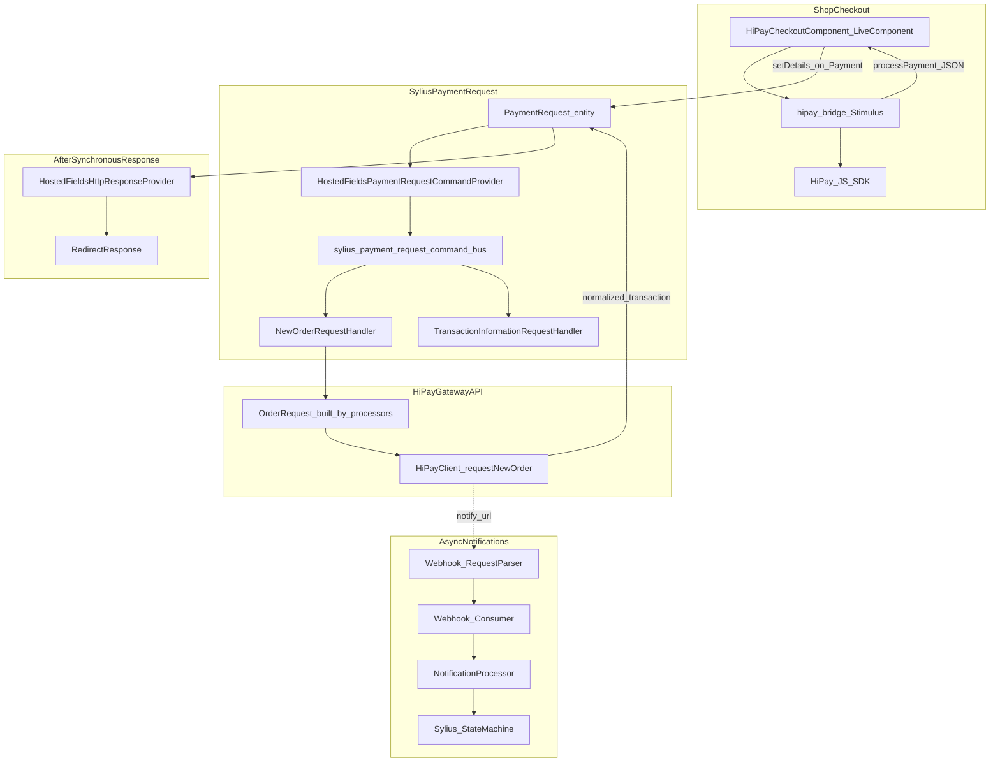
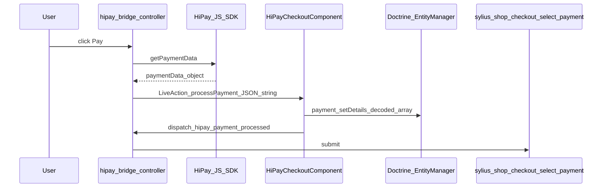
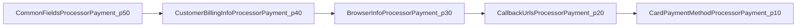
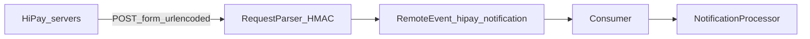

# HiPay payment workflow (SyliusHiPayPlugin)

This document describes the **end-to-end payment flow** implemented in this plugin. It is written for **developers** and for **LLM-assisted extension** (file paths, contracts, and extension points are explicit).

**Related docs**

- [Add a new payment product](./add-payment-product.md)
- [Domain events](./events.md)
- [HiPay status code mapping](./hipay-status-mapping.md)
- [Content Security Policy](./content-security-policy.md)

**Official HiPay documentation**

- [Transaction status](https://developer.hipay.com/payment-fundamentals/essentials/transaction-status)
- [Notifications (webhooks)](https://developer.hipay.com/payment-fundamentals/requirements/notifications)
- [Signature verification](https://developer.hipay.com/payment-fundamentals/requirements/signature-verification)
- [Hosted Fields / JS SDK](https://developer.hipay.com/doc/hipay-hosted-fields/)

## Table of contents

- [A. Overview](#a-overview)
- [B. Shop checkout: LiveComponent + HiPay JS SDK](#b-shop-checkout-livecomponent-hipay-js-sdk)
- [C. Payment Request pipeline (Sylius + Messenger)](#c-payment-request-pipeline-sylius-messenger)
- [D. Order Request builder pipeline (processors)](#d-order-request-builder-pipeline-processors)
- [E. Webhook / asynchronous notifications](#e-webhook-asynchronous-notifications)
- [F. Payment product handler](#f-payment-product-handler)
- [G. Domain events](#g-domain-events)
- [Quick reference: key routes and services](#quick-reference-key-routes-and-services)
- [LLM prompt hints](#llm-prompt-hints)

---

## A. Overview

At a high level:

1. **Shop checkout** renders a Symfony UX **LiveComponent** that loads the **HiPay JS SDK** and collects card data in the browser.
2. The SDK returns **payment data** (JSON). The LiveComponent stores it on **`Payment::details`** (Sylius Core `Payment`).
3. The customer submits the normal Sylius **select payment** form. Sylius **Payment Request** flow runs: a **Messenger** command is dispatched on `sylius.payment_request.command_bus`.
4. **`NewOrderRequestHandler`** (or **`TransactionInformationRequestHandler`**) builds a HiPay **`OrderRequest`** via a **processor pipeline**, calls **`requestNewOrder`** (or **`requestTransactionInformation`**) on the HiPay PHP SDK client.
5. **`HostedFieldsHttpResponseProvider`** chooses the **HTTP redirect** (thank-you, 3DS forward URL, or order page) from **`PaymentRequest::responseData['state']`**.
6. **Asynchronously**, HiPay POSTs **server-to-server notifications** to the Symfony **Webhook** endpoint; **`NotificationProcessor`** maps **status codes** to Sylius **payment state machine** transitions.

---

## B. Shop checkout: LiveComponent + HiPay JS SDK

### B.1 Twig and LiveComponent wiring

- The checkout template includes the LiveComponent when the gateway is **`hipay_hosted_fields`**. See hooks under [`config/twig_hooks/shop/checkout.yaml`](../config/twig_hooks/shop/checkout.yaml) and templates under [`templates/shop/checkout/`](../templates/shop/checkout/).
- Component template: [`templates/components/hipay_checkout.html.twig`](../templates/components/hipay_checkout.html.twig) — mounts Stimulus controller **`hipay-bridge`** with `initialConfig: this.getJsSdkConfig()|json_encode`.

### B.2 `HiPayCheckoutComponent`

**File:** [`src/Twig/Component/Shop/HiPayCheckoutComponent.php`](../src/Twig/Component/Shop/HiPayCheckoutComponent.php)

- **`getJsSdkConfig()`** resolves:
  - **Account** credentials via `AccountProviderInterface::getByPaymentMethod($paymentMethod)`.
  - **Payment product handler** via `PaymentProductHandlerRegistryInterface::getForPaymentMethod($paymentMethod)` (uses `gatewayConfig['payment_product']`).
  - **SDK `configuration`** from `PaymentProductHandlerInterface::getJsInitConfig($paymentMethod)` (for card: styles, brands, one-click cards, etc.).
- Returns a structure consumed by the JS bridge: `product`, `username`, `password`, `environment`, `debug`, `lang`, `configuration`.
- Dispatches **`CheckoutSdkConfigResolvedEvent`** so projects can tweak the payload without subclassing the LiveComponent ([events.md](./events.md)).

### B.3 Loading the HiPay SDK script

- [`templates/shop/checkout/javascripts/hipay_js_sdk.html.twig`](../templates/shop/checkout/javascripts/hipay_js_sdk.html.twig) uses Twig functions from [`src/Twig/Extension/HipayExtension.php`](../src/Twig/Extension/HipayExtension.php):
  - **`hipay_js_sdk_url()`** → `https://libs.hipay.com/js/sdkjs.js`
  - **`hipay_integrity_hash()`** → fetches SRI hash from HiPay

### B.4 Stimulus controller `hipay-hosted-fields`

**File:** [`assets/controllers/hipay_hosted_fields_controller.js`](../assets/controllers/hipay_hosted_fields_controller.js)

| Phase | Behaviour |
|-------|-----------|
| **connect** | Builds `HiPay({...}).create(product, configuration)`, mounts hosted fields into the `[data-hipay-hosted-fields-placeholder]` target, enables pay button on SDK `change` when form is valid. |
| **Events** | Custom events dispatched on the controller element (prefix `hipay:hosted-fields:`): `before-connect` (cancelable), `ready`, `before-submit` (cancelable), `after-submit`, `cancel`, `error`. |
| **submitPayment / processPaymentData** | `await hostedPaymentsInstance.getPaymentData()` (or SDK `paymentAuthorized` callback) → emits `before-submit` → `this.component.action('processPayment', { response: JSON.stringify(finalPaymentData) })` → emits `after-submit`. |
| **After LiveComponent** | Listens for `hipay:payment:processed` on `window` → calls `completePaymentWithSuccess()` then submits the closest `<form>`. |

### B.5 `processPayment` LiveAction

Still in **`HiPayCheckoutComponent`**:

1. Decodes `response` with the injected **serializer** (`decode(..., 'json')`).
2. Dispatches **`CheckoutPaymentDetailsDecodedEvent`** (listeners may mutate details), then **`$payment->setDetails(...)`** — processors later read **`PaymentOrderRequestContext::$payload`** from **`$payment->getDetails()`** (see [`PaymentOrderRequestContextFactory`](../src/PaymentOrderRequest/PaymentOrderRequestContextFactory.php)).
3. **`persist` + `flush`**
4. Dispatches **`CheckoutPaymentDetailsPersistedEvent`**, then browser event **`hipay:payment:processed`** so the Stimulus layer submits the checkout form.

**HiPay reference:** the shape of `getPaymentData()` follows HiPay Hosted Fields / SDK documentation (token, browser context, etc.). Align new front-end flows with [HiPay Hosted Fields](https://developer.hipay.com/doc/hipay-hosted-fields/).

---

## C. Payment Request pipeline (Sylius + Messenger)

Sylius **Payment Request** associates a **`PaymentRequest`** entity with actions (`capture`, `authorize`, `status`, …). This plugin binds the **`hipay_hosted_fields`** gateway factory to specific services via Symfony tags (see [`config/services.php`](../config/services.php)).

### C.1 Command provider

**File:** [`src/CommandProvider/HostedFieldsPaymentRequestCommandProvider.php`](../src/CommandProvider/HostedFieldsPaymentRequestCommandProvider.php)

- **`supports`:** `ACTION_CAPTURE`, `ACTION_AUTHORIZE`, `ACTION_STATUS`.
- **`provide`:**
  - `capture` / `authorize` → **`NewOrderRequest`** (hash from `PaymentRequest`)
  - `status` → **`TransactionInformationRequest`**

### C.2 Message handlers

Registered on **`sylius.payment_request.command_bus`**:

| Handler | Command | Role |
|---------|---------|------|
| [`NewOrderRequestHandler`](../src/CommandHandler/NewOrderRequestHandler.php) | `NewOrderRequest` | Build HiPay `OrderRequest`, `requestNewOrder`, persist `Transaction`, set `PaymentRequest` / `Payment` states |
| [`TransactionInformationRequestHandler`](../src/CommandHandler/TransactionInformationRequestHandler.php) | `TransactionInformationRequest` | Load `transaction_reference` from DB, `requestTransactionInformation` |
| [`HostedFieldsPaymentRequestHandler`](../src/CommandHandler/HostedFieldsPaymentRequestHandler.php) | N/A (no-op) | Satisfies Messenger if other message types are registered; real work is in the handlers above |

Shared constructor dependencies are defined in **`config/services.php`** (`$paymentRequestMessageHandlerArgs`).

### C.3 Abstract handler: state machines

**File:** [`src/CommandHandler/AbstractPaymentRequestHandler.php`](../src/CommandHandler/AbstractPaymentRequestHandler.php)

- Applies **PaymentRequest** transitions (`process`, `complete`, `fail`) and **Payment** transitions (`process`, `fail`, `hold` for fraud sentinel) via Sylius **`StateMachineInterface`**.
- **`NewOrderRequestHandler`** on HiPay **`PENDING`** state: **`setOnHold`** + fraud email (`FraudSuspicionEmailManager`).

### C.4 `NewOrderRequestHandler` (synchronous API call)

1. Resolve **`PaymentRequest`** from command hash (`PaymentRequestProvider`).
2. **`PaymentOrderRequestContextFactory::buildFromPaymentRequest`** → context with **`payload = $payment->getDetails()`** (see section B).
3. **`builderRegistry->get($context->paymentProduct)->build($context)`** → HiPay **`OrderRequest`**.
4. Dispatch **`BeforeOrderRequestEvent`** (mutate `OrderRequest` or set **`alternativeResponseData`** to skip `requestNewOrder()`).
5. Normalize order request → **`PaymentRequest::setPayload`**.
6. **`hiPayClientProvider->getForAccount($account)->requestNewOrder($orderRequest)`** (unless skipped).
7. Normalize transaction → **`PaymentRequest::setResponseData`** (or use alternative payload when skipped).
8. Dispatch **`AfterPaymentProcessedEvent`**; listeners may change **`responseData`** before state mapping.
9. **`saveTransaction`** when the API ran — persists **`hipay_transaction`** and **flushes immediately** (webhook can arrive quickly).
10. Map **`state`** in **`responseData`**: declined/error → fail; pending → on-hold path; else complete payment request.

### C.5 `HostedFieldsHttpResponseProvider`

**File:** [`src/OrderPay/Provider/HostedFieldsHttpResponseProvider.php`](../src/OrderPay/Provider/HostedFieldsHttpResponseProvider.php)

- Reads **`$paymentRequest->getResponseData()['state']`** (HiPay **`TransactionState`** constants when normalized from SDK).
- **`forwarding`** → redirect to **`forwardUrl`** if present (3DS / redirect flows).
- **`completed`** / **`pending`** → thank-you route.
- **default** → order show or homepage.

**Note:** This provider does **not** call `PaymentProductHandlerInterface`; redirect policy is centralized here.

---

## D. Order Request builder pipeline (processors)

### D.1 Context factory

**File:** [`src/PaymentOrderRequest/PaymentOrderRequestContextFactory.php`](../src/PaymentOrderRequest/PaymentOrderRequestContextFactory.php)

Builds **`PaymentOrderRequestContext`** with:

- `order`, `payment`, `paymentRequest`, `account` (from `gatewayConfig['account']`)
- **`paymentProduct`** from `gatewayConfig['payment_product']`
- **`payload`** = **`$payment->getDetails()`** (JSON-decoded SDK output + any keys your front-end adds)
- **`gatewayConfig`**, **`action`**

### D.2 Builder and registry

- **Builder:** [`src/PaymentOrderRequest/PaymentOrderRequestBuilder.php`](../src/PaymentOrderRequest/PaymentOrderRequestBuilder.php) — iterates processors, each mutates **`OrderRequest`**.
- **Registry:** [`src/PaymentOrderRequest/PaymentOrderRequestBuilderRegistry.php`](../src/PaymentOrderRequest/PaymentOrderRequestBuilderRegistry.php) — first builder where **`supports($paymentProduct)`** matches **`$context->paymentProduct`**.

**Important:** The **stored** `payment_product` in gateway config must match a builder’s internal code **or** the builder’s **`supports()`** logic. Example: **`CardHandler`** supports `visa`, `cb`, etc., but the **card** builder is registered for product code **`card`** — ensure gateway configuration and API product codes stay consistent (see [add-payment-product.md](./add-payment-product.md)).

### D.3 Card pipeline (tag `sylius_hipay_plugin.order_request_processor.card`)

Declared in [`config/services.php`](../config/services.php). **Priority** controls order (higher runs first with Symfony’s tagged iterator + `defaultPriorityMethod: '__none__'`).

| Processor | Sets on `OrderRequest` | Main inputs |
|-----------|----------------------|-------------|
| [`CommonFieldsProcessorPayment`](../src/PaymentOrderRequest/Processor/CommonFieldsProcessorPayment.php) | `orderid`, `description`, `amount`, `currency`, `shipping`, `tax`, `operation` (Authorization vs Sale) | `context.order`, `context.payment`, `context.action`, clock |
| [`CustomerBillingInfoProcessorPayment`](../src/PaymentOrderRequest/Processor/CustomerBillingInfoProcessorPayment.php) | `customerBillingInfo` | Billing address on order |
| [`BrowserInfoProcessorPayment`](../src/PaymentOrderRequest/Processor/BrowserInfoProcessorPayment.php) | `device_fingerprint`, `ipaddr`, `browser_info` | `context.payload`, `RequestStack` |
| [`CallbackUrlsProcessorPayment`](../src/PaymentOrderRequest/Processor/CallbackUrlsProcessorPayment.php) | `accept_url`, `decline_url`, `pending_url`, `cancel_url`, `exception_url`, **`notify_url`** | Router; webhook route `sylius_hipay_plugin_webhook` |
| [`CardPaymentMethodProcessorPayment`](../src/PaymentOrderRequest/Processor/CardPaymentMethodProcessorPayment.php) | `payment_product`, `one_click`, `multi_use`, **`paymentMethod`** (`CardTokenPaymentMethod`) | `context.payload` (`token`, `payment_product`, …), `gatewayConfig` (3DS mode) |

**Contract:** [`PaymentOrderRequestProcessorInterface`](../src/PaymentOrderRequest/PaymentOrderRequestProcessorInterface.php) — processors **only** read **`$context`** and write **`$orderRequest`**; do not read fields set by other processors (convention).

---

## E. Webhook / asynchronous notifications

### E.1 Entry

- Symfony **Webhook** routing: [`config/framework.yaml`](../config/framework.yaml) → parser service id **`sylius_hipay_plugin.webhook.request_parser`**.
- **Parser:** [`src/Webhook/RequestParser.php`](../src/Webhook/RequestParser.php) — POST, `application/x-www-form-urlencoded`, mandatory **`transaction_reference`** + **`status`**, HMAC validation via [`HmacValidator`](../src/Validator/HmacValidator.php).
- **Consumer:** [`src/Webhook/Consumer.php`](../src/Webhook/Consumer.php) → **`NotificationProcessor::process`**.

### E.2 `NotificationProcessor`

**File:** [`src/Webhook/NotificationProcessor.php`](../src/Webhook/NotificationProcessor.php)

1. Resolve **`Payment`** by **`transaction_reference`** (`TransactionProvider`).
2. Dispatch **`BeforeWebhookNotificationProcessedEvent`** (dedicated class, default listener key = FQCN).
3. Create a **new** `PaymentRequest` with action from **`HiPayStatus::getPaymentRequestAction($status)`**, persist, set process state.
4. **`unholdPaymentIfNeeded`** if payment was on hold.
5. **`HiPayStatus::getSyliusTransition($status)`** → apply Sylius **`Payment`** transition if allowed.
6. Complete/cancel the webhook `PaymentRequest`, flush.
7. On the success path (transition applied), dispatch **`AfterWebhookNotificationProcessedEvent`**. If no transition can be applied, only the “before” event ran; the processor cancels the webhook `PaymentRequest` and returns without an “after” event.

See [events.md](./events.md) for all checkout and payment-request events.

**HiPay:** notification payload format and signature rules — [Notifications](https://developer.hipay.com/payment-fundamentals/requirements/notifications), [Signature verification](https://developer.hipay.com/payment-fundamentals/requirements/signature-verification).

**Status → Sylius:** see [hipay-status-mapping.md](./hipay-status-mapping.md) and enum [`src/Payment/HiPayStatus.php`](../src/Payment/HiPayStatus.php).

---

## F. Payment product handler

Handlers configure **admin forms** and **JS SDK init** per HiPay product. They do **not** drive webhook mapping (that is **`HiPayStatus`**).

### F.1 Interface

**File:** [`src/PaymentProduct/PaymentProductHandlerInterface.php`](../src/PaymentProduct/PaymentProductHandlerInterface.php)

| Method | Purpose |
|--------|---------|
| `supports(string $paymentProduct)` | Whether this handler handles a HiPay product code (e.g. `visa` → card handler) |
| `getCode()` | Stable plugin code (`card`) — used as Symfony service tag attribute |
| `getName()` | Translation key for labels |
| `getFormType()` | Admin `FormType` class (e.g. card-specific options); may extend [`GeneralConfigurationType`](../src/Form/Type/Gateway/PaymentProductConfiguration/GeneralConfigurationType.php) |
| `getJsInitConfig(PaymentMethodInterface)` | Array passed to JS SDK `configuration` |
| `getAvailableCountries()` / `getAvailableCurrencies()` | Restrict **admin** multiselect choices in general configuration (empty = all) |

### F.2 Base class

**File:** [`src/PaymentProduct/Handler/AbstractPaymentProductHandler.php`](../src/PaymentProduct/Handler/AbstractPaymentProductHandler.php) — default `supports()` matches **`$code`**; empty country/currency lists; `getFormType()` null.

### F.3 Registry

**File:** [`src/PaymentProduct/PaymentProductHandlerRegistry.php`](../src/PaymentProduct/PaymentProductHandlerRegistry.php)

- **`get($code)`** — service locator by tag attribute `code`.
- **`getForPaymentProduct($product)`** — first handler where `supports($product)`.
- **`getForPaymentMethod($method)`** — reads `gatewayConfig['payment_product']`.

### F.4 Reference implementation: `CardHandler`

**File:** [`src/PaymentProduct/Handler/CardHandler.php`](../src/PaymentProduct/Handler/CardHandler.php)

- **`supports`:** `card`, `visa`, `mastercard`, `cb`, `maestro`, `american-express`, `bcmc`.
- **`getJsInitConfig`:** styles, optional `brand`, one-click card list from repository.
- Registered in **`config/services.php`** with tag **`sylius_hipay_plugin.payment_product_handler`** and `code: card`.

### F.5 Checkout eligibility (separate from handler)

**File:** [`src/Resolver/PaymentMethodsResolver.php`](../src/Resolver/PaymentMethodsResolver.php) decorates Sylius channel-based resolver and filters **`hipay_hosted_fields`** methods by **`configuration.allowed_countries`**, **`allowed_currencies`**, **`minimum_amount`**, **`maximum_amount`** (from gateway config). This is **not** `PaymentProductHandlerInterface`.

---

## G. Domain events

Symfony **`EventDispatcher`** is used with **event classes** as the dispatch name (no shared string-constant bag).

| Area | Classes |
|------|---------|
| Checkout UI | `CheckoutSdkConfigResolvedEvent`, `CheckoutPaymentDetailsDecodedEvent`, `CheckoutPaymentDetailsPersistedEvent` — see [`HiPayCheckoutComponent`](../src/Twig/Component/Shop/HiPayCheckoutComponent.php). |
| New order API | `BeforeOrderRequestEvent`, `AfterPaymentProcessedEvent` — see [`NewOrderRequestHandler`](../src/CommandHandler/NewOrderRequestHandler.php). |
| Transaction info | `AfterPaymentProcessedEvent` — see [`TransactionInformationRequestHandler`](../src/CommandHandler/TransactionInformationRequestHandler.php). |
| Webhook | `BeforeWebhookNotificationProcessedEvent`, `AfterWebhookNotificationProcessedEvent` — see [`NotificationProcessor`](../src/Webhook/NotificationProcessor.php). |

Full tables and listener examples: [events.md](./events.md).

---

## Quick reference: key routes and services

| Concern | Route / service id |
|---------|-------------------|
| Webhook | Route name `sylius_hipay_plugin_webhook` (see plugin routing) |
| After-pay callbacks | `sylius_shop_order_after_pay` with `hash` (set in `CallbackUrlsProcessorPayment`) |
| Handler registry | `sylius_hipay_plugin.payment_product.handler_registry` |
| Order request registry | `sylius_hipay_plugin.payment_order_request.order_request_registry` |
| Card builder | `sylius_hipay_plugin.payment_order_request.order_request.card` |

---

## LLM prompt hints

When extending this plugin, an LLM should:

1. Trace **`payment.details`** from **`HiPayCheckoutComponent::processPayment`** through **`PaymentOrderRequestContext::$payload`** into processors.
2. Add or tag new **`PaymentOrderRequestProcessorInterface`** implementations and attach them to a **builder** via the same tag namespace pattern as card.
3. Keep **`gatewayConfig['payment_product']`** aligned with **`PaymentOrderRequestBuilder::supports()`**.
4. Rely on **`HiPayStatus`** for webhook behaviour, not on payment product handlers.
5. Hook cross-cutting behaviour with **event classes** in [events.md](./events.md) (`YourEvent::class` as subscriber key).
6. Cite official HiPay docs for **notification fields**, **status codes**, and **SDK** contracts.
